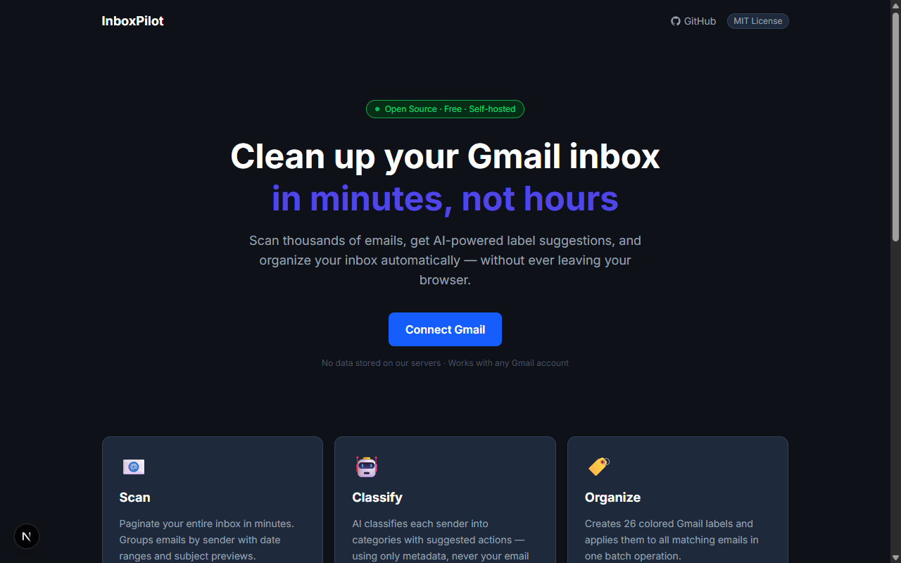

# InboxPilot

> AI-powered Gmail cleanup — scan thousands of emails, get label suggestions, and organize your inbox automatically.

[](https://opensource.org/licenses/MIT)
[](https://nextjs.org)
[](https://typescriptlang.org)



## Features

- **Full inbox scan** — paginate your entire Gmail inbox, grouped by sender
- **AI classification** — Claude, GPT-4o, Ollama, or any OpenAI-compatible API
- **26 colored labels** — auto-created in Gmail with one click
- **Batch labeling** — up to 1,000 emails per Gmail API call
- **Privacy-first** — AI only sees sender metadata, never email content
- **Resumable** — SQLite cache means rescans are instant
- **Works without LLM** — heuristic pre-classification included

## Quick Start (Docker)

```bash
git clone https://github.com/your-username/inboxpilot.git
cd inboxpilot
cp .env.example .env.local
# Fill in GOOGLE_CLIENT_ID, GOOGLE_CLIENT_SECRET, AUTH_SECRET in .env.local
docker-compose up
```

Open http://localhost:3000

> First time: see [Google Cloud Setup](#google-cloud-setup) to get your credentials.

## Manual Setup

### Prerequisites

- Node.js 20+
- A Google account with Gmail

### 1. Clone and install

```bash
git clone https://github.com/your-username/inboxpilot.git
cd inboxpilot
npm install
```

### 2. Set up Google Cloud credentials

See [docs/SETUP.md](docs/SETUP.md) for step-by-step instructions.

### 3. Configure environment

```bash
cp .env.example .env.local
```

Edit `.env.local`:
```env
GOOGLE_CLIENT_ID=your-client-id
GOOGLE_CLIENT_SECRET=your-client-secret
NEXTAUTH_URL=http://localhost:3000
AUTH_SECRET=run-openssl-rand-base64-32
```

Generate `AUTH_SECRET`:
```bash
openssl rand -base64 32
```

### 4. Start the dev server

```bash
npm run dev
```

Open http://localhost:3000, click "Connect Gmail", sign in.

## LLM Provider Setup

InboxPilot works without an LLM (heuristic classification only). To enable AI classification:

### Anthropic Claude (Recommended)

1. Get an API key at [console.anthropic.com](https://console.anthropic.com)
2. In InboxPilot Settings: select "Anthropic Claude", paste your key
3. Recommended model: `claude-sonnet-4-6`

### OpenAI / GPT

1. Get an API key at [platform.openai.com](https://platform.openai.com)
2. In Settings: select "OpenAI / GPT", paste your key
3. Recommended model: `gpt-4o-mini` (fast and cheap)

### Ollama (Free, local)

1. Install [Ollama](https://ollama.ai) and run: `ollama pull llama3`
2. In Settings: select "Ollama", base URL: `http://localhost:11434`
3. No API key needed

### OpenAI-Compatible

Works with Together AI, Groq, LM Studio, and any OpenAI-compatible endpoint.
In Settings: select "OpenAI-compatible", provide base URL and API key.

## Architecture

### Request flow

```
Browser                    Next.js Server              External
───────                    ──────────────              ────────
Landing (/)
  └─ Connect Gmail ──────► NextAuth v5 ─────────────► Google OAuth2
                            JWT cookie ◄────────────── access_token
                                                        refresh_token
Dashboard (/dashboard)
  └─ Start Scan ──────────► /api/gmail/scan (SSE)
                              ├─ messages.list ────────► Gmail API
                              ├─ messages.get ×N ──────► Gmail API
                              └─ cache results ────────► SQLite

  └─ Classify with AI ────► /api/classify (SSE)
                              ├─ batch 15 senders
                              ├─ safety overrides (code-enforced)
                              └─ classify ─────────────► Anthropic / OpenAI
                                                          Ollama / compatible

  └─ Execute in Gmail ────► /api/labels (SSE)
                              └─ labels.create ─────────► Gmail API
                            /api/labels/apply (SSE)
                              └─ batchModify ×1000 ─────► Gmail API
```

### Codebase structure

```
src/
├── app/
│   ├── page.tsx                    Landing page (public)
│   ├── dashboard/
│   │   ├── page.tsx                Protected server component
│   │   └── DashboardClient.tsx     Full scan→classify→approve→execute flow
│   ├── settings/
│   │   └── page.tsx                LLM provider config
│   └── api/
│       ├── auth/[...nextauth]/     NextAuth handlers
│       ├── gmail/scan/             Inbox scan SSE stream
│       ├── classify/               LLM classification SSE stream
│       ├── classify/test/          Provider connection test
│       ├── labels/                 Label creation SSE stream
│       └── labels/apply/           Label application SSE stream
│
├── lib/
│   ├── gmail/
│   │   ├── types.ts                MessageMetadata, SenderSummary, ScanResult
│   │   ├── scanner.ts              Phase 1 (list IDs) + Phase 2 (metadata fetch)
│   │   ├── aggregator.ts           Group messages by sender
│   │   ├── heuristics.ts           Rule-based pre-classification
│   │   └── labeler.ts              labels.create + batchModify (1000/call)
│   ├── llm/
│   │   ├── provider.ts             LLMProvider interface + safety overrides
│   │   ├── anthropic.ts            @anthropic-ai/sdk
│   │   ├── openai.ts               openai sdk
│   │   ├── ollama.ts               fetch → localhost:11434
│   │   ├── compatible.ts           OpenAI SDK with custom baseURL
│   │   └── classifier.ts           Batch orchestrator + AsyncGenerator stream
│   ├── batching/
│   │   ├── token-counter.ts        Batch size by model context window
│   │   └── retry.ts                Exponential backoff, 429 detection
│   ├── db.ts                       sql.js SQLite cache (scan results)
│   └── labels.ts                   26 label definitions with Gmail hex colors
│
└── components/
    ├── ScanProgress.tsx            Real-time scan progress (EventSource)
    ├── StatsCards.tsx              5 derived metric cards
    ├── SenderTable.tsx             Sort/filter/search/paginate table
    ├── LabelPreview.tsx            Gmail sidebar preview
    ├── ApprovalPanel.tsx           List + one-by-one review, safety locks
    ├── ExecutionLog.tsx            Terminal-style real-time log
    ├── ExecutionResults.tsx        Post-execution summary + CSV export
    ├── LLMConfig.tsx               Provider settings form
    └── useToast.tsx                Stacking toast notifications
```

### Key design decisions

| Decision | Choice | Reason |
|----------|--------|--------|
| Auth | NextAuth v5 JWT (stateless) | No DB needed for auth; tokens in encrypted cookies |
| Gmail metadata only | `format: "metadata"` + headers | Privacy — never reads email body |
| Batch strategy | Promise.all chunks of 50, 1s sleep | 250 quota units/sec limit (50 × 5 units) |
| Label application | `batchModify` up to 1000 IDs | Single API call vs. one-by-one would be 1000× slower |
| Safety overrides | Post-LLM code enforcement | LLM cannot override financial/government/security rules |
| API keys | localStorage only | Never logged or stored server-side |
| SQLite | sql.js (pure WASM) | Works on Windows without native compilation |
| Streaming | ReadableStream + SSE | Real-time progress for multi-minute operations |

## Privacy & Security

- **No email content** — the AI only sees: sender email, sender name, message count, date range, and first 5 words of subject lines. Never the email body.
- **No external storage** — scan results are cached in a local SQLite file (`data/scans.db`).
- **API keys in localStorage** — your LLM API keys are stored in your browser only. They're sent to the classification endpoint in the request body but never logged or stored server-side.
- **OAuth tokens in cookies** — Gmail access tokens are stored in encrypted NextAuth JWT cookies.
- **Self-hosted** — you run the server. No SaaS, no accounts, no subscriptions.

## Google Cloud Setup

See [docs/SETUP.md](docs/SETUP.md) for detailed instructions.

## How it was built

InboxPilot was built entirely with [Claude Code](https://claude.ai/claude-code) using a **dispatching-parallel-agents** pattern — the same pattern documented in this repo.

### The approach

Instead of building features sequentially, the implementation used parallel agent dispatch: independent modules were identified, briefed as isolated agents, and executed concurrently. Each agent received only the context it needed and produced a single focused output.

**Example: building the LLM provider system (Prompt 4)**

```
Wave 1 — parallel (no file overlap):
  Agent A → provider.ts + token-counter.ts + retry.ts  (pure types + utilities)
  Agent B → LLMConfig.tsx + settings/page.tsx           (settings UI)

Wave 2 — parallel (all depend on provider.ts):
  Agent C → anthropic.ts + openai.ts    (SDK-backed providers)
  Agent D → ollama.ts + compatible.ts   (fetch-based providers)

Wave 3 — sequential (depends on all providers):
  → classifier.ts  (batch orchestrator + async generator)

Wave 4 — parallel:
  Agent E → /api/classify route         (SSE endpoint)
  Agent F → ApprovalPanel.tsx           (review UI)

Wave 5 — sequential:
  → wire DashboardClient + build check
```

This pattern was repeated across all 6 prompts. The full project — scanner, classification pipeline, label execution engine, settings, UI, Docker, and docs — was built across **~25 parallel agent dispatches** with zero file conflicts.

### Why it works

- **Isolation** — agents don't share context or history, so they stay focused
- **Parallelism** — independent modules build concurrently (4 providers in the time of 1)
- **Correctness** — each agent gets the exact types and interfaces it needs; TypeScript validates integration
- **Speed** — the entire application was built in a single session

The session transcript and all design specs are preserved in `docs/superpowers/`.

## Contributing

See [CONTRIBUTING.md](CONTRIBUTING.md).

## License

[MIT](LICENSE) — free for personal and commercial use.
